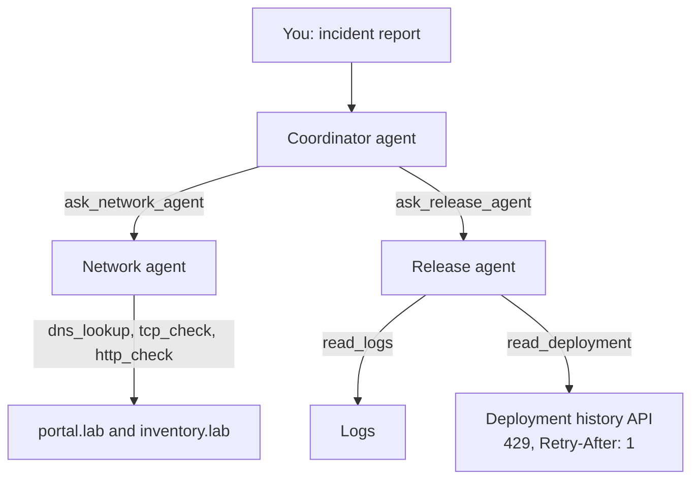
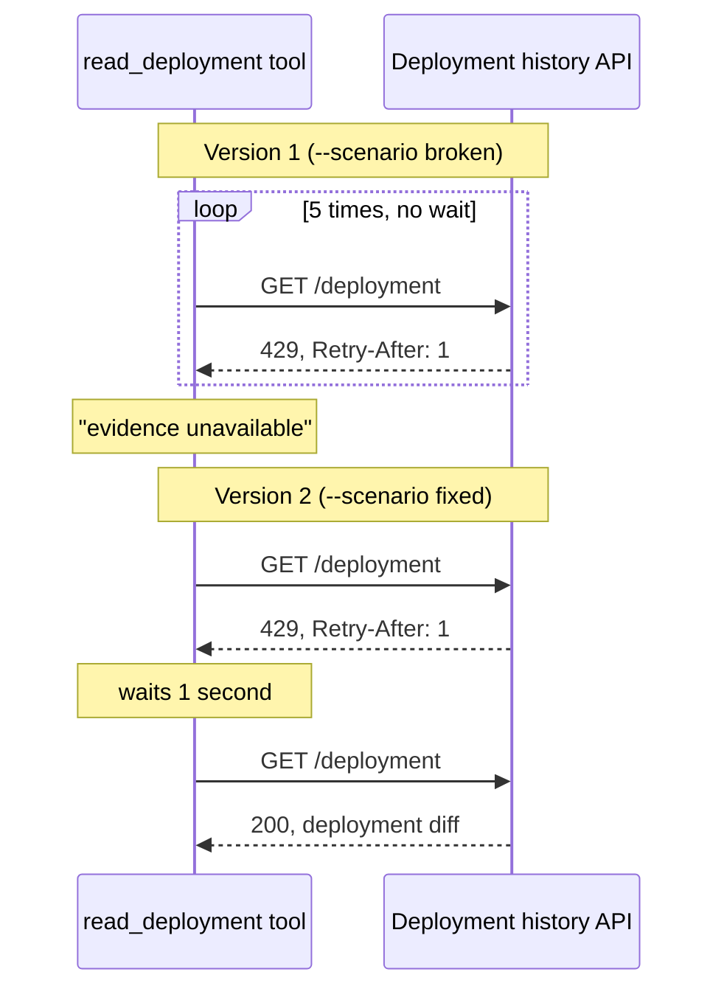

# Debugging AI Agents with Honeycomb

A lab by Du'An Lightfoot for [LabEveryday](https://www.youtube.com/@LabEveryday) · [duanlightfoot.com](https://www.duanlightfoot.com)

*The video link goes here when the episode is published.*

An internal portal stops loading inventory after a deployment. Three AI agents investigate. The answer sits in the deployment history, but that API is busy. It answers HTTP 429 and asks you to retry after one second.

You run two versions of the tool that reads the deployment history. Then you use Honeycomb's Agent Timeline to see why one fails and the other finds the cause.

## The story

1. **The bug.** Deployment `r42` changed `INVENTORY_BASE_URL` from `/inventory/v2` to `/inventory/v1`. Version 1 of the inventory API is retired, so the portal fails. The agents get the symptom and nothing more.
2. **The agents.** A coordinator hands the work to two specialists. The network agent picks its own DNS, port, and HTTP checks. The release agent answers "what changed?" from the deployment history and the logs.
3. **The failure.** Version 1 of the tool retries right away, five times in under 50 ms, and ignores `Retry-After`. Every attempt gets a 429, so the agents have to guess at the cause.
4. **The fix.** Version 2 waits as long as `Retry-After` asks, then tries once more. The second request returns the deployment history, and the agents name the cause.
5. **The follow-up.** You approve the rollback. The lab records it as deploy `r43` and sends a second message in the same conversation, and the agents confirm the portal works.

The incident data is fake. The HTTP requests and model calls are real. The agents can read evidence and recommend a fix, but they can't change anything.

## How it works





The agents use PydanticAI with a Claude model. PydanticAI records each model call, tool call, and handoff between agents as an OpenTelemetry span. The lab adds a span for each HTTP request, so you can see each retry.

## Setup

You need Python 3.12 or later and [uv](https://docs.astral.sh/uv/getting-started/installation/).

```bash
uv sync --locked
cp .env.example .env
```

On Windows PowerShell, use `Copy-Item .env.example .env`. Your file browser may hide files that start with a dot. If you can't see `.env.example`, create a file named `.env` next to `main.py`.

Fill in `.env`:

```dotenv
ANTHROPIC_API_KEY=your_api_key
MODEL=claude-sonnet-5-5
HONEYCOMB_API_KEY=your_honeycomb_ingest_key
```

- Get `ANTHROPIC_API_KEY` from your Anthropic account. Live runs make paid API calls.
- `HONEYCOMB_API_KEY` is optional. Leave it blank to keep traces on your machine. For a Honeycomb account in the EU, also set `OTEL_EXPORTER_OTLP_TRACES_ENDPOINT=https://api.eu1.honeycomb.io/v1/traces`.

To try the lab without an API key, add `--offline` to any command. Offline runs use scripted answers in place of a model, so the output says `SCRIPTED SMOKE TEST`. If your Honeycomb key is set, offline runs still send traces.

## Run it

| Command | What you get in Honeycomb |
| --- | --- |
| `uv run main.py --scenario broken` | One conversation with one trace. The deployment tool fails. |
| `uv run main.py --scenario fixed`, then answer `n` | One conversation with one trace. The fix works. |
| `uv run main.py --scenario fixed`, then answer `y` | One conversation with two traces: the fix, then a follow-up after the rollback. |
| `uv run samples.py` | Ten more conversations with 2 to 10 messages each, three running at a time. |

Each run prints its conversation ID, like `broken-20261003-163531`, then each step as the agents work. Search for that ID in Honeycomb. A live `samples.py` run takes 5 to 8 minutes.

The two scenarios differ in one place, the retry rule in `lab/tools.py`:

| Scenario | Retry rule | Result |
| --- | --- | --- |
| `broken` | Retry any failure right away, up to five times | 5 requests in under 50 ms, all 429. The agents guess. |
| `fixed` | On a 429, wait as long as `Retry-After` asks, then try once more | A 429, a one-second wait, then a 200. The agents name the cause. |

## See it in Honeycomb

Go to **AI Ecosystem**, then **Conversations**, and search for the conversation ID. The [Agent Timeline](https://docs.honeycomb.io/investigate/observe/agent-timeline/) shows:

- Totals at the top: duration, traces, model calls, tool calls, failures, and tokens.
- One lane per agent. Click a handoff to see the task the coordinator wrote.
- In `broken`, **Show failures only** finds `read_deployment`. Open it in the Traces view to see five HTTP requests, each with `http.response.header.retry-after`.
- In `fixed`, the same tool call shows two requests one second apart.
- On the coordinator's span, the GenAI tab shows an eval. `cause_backed_by_evidence` fails in `broken` and passes in `fixed`.
- In the conversation list, a filter on `error.type = evidence_unavailable` finds the runs where the tool gave up.

A span is one operation, like a model call or an HTTP request. A trace holds all the spans from one message. The conversation ID ties the traces of one conversation together. One tool call can hold several HTTP requests. In `broken`, the model asked once and your code sent all five.

## Project layout

```
main.py              Runs the incident, broken or fixed
samples.py           Runs ten sample conversations
lab/
  agents.py          The three agents, their tools, the eval, and the step-by-step output
  tools.py           HTTP client: allowed endpoints, a span per request, retry versions 1 and 2
  server.py          Local test server with the portal, the inventory API, and the busy deployment API
  telemetry.py       Tracing setup
  fixtures.json      The fake incident data
tests/test_lab.py    Tests
```

Each run writes `result.json` and `spans.jsonl` to `artifacts/<conversation-id>/`. Git ignores `artifacts/` and `.env`.

## Tests

```bash
uv run pytest -q
```

The tests run offline. They cover both retry versions, the network checks, the rollback, the eval, and how the spans connect into traces and conversations.

<details>
<summary><strong>Notes</strong></summary>

- The DNS records, logs, and deployment history come from `lab/fixtures.json`. The lab doesn't run real DNS lookups, and the portal is a stand-in for a deployed app.
- The agents can call fixed local endpoints and nothing else. They can't run shell commands or change configuration. The lab applies the rollback for you between turns.
- The network agent reads hostnames from the DNS fixture, opens real TCP connections to the local server, and sends real HTTP requests. Lab hosts answer on ports 80 and 443. The network agent can reach `portal.lab` and `inventory.lab`; the deployment history belongs to the release agent.
- The deployment API rejects requests for half a second after the first one and sends `Retry-After: 1`, rounded up to a whole second. Version 2 waits at most 5 seconds and tries twice. Each request times out after 2 seconds.
- Each turn has a 120-second timeout and shared limits of 30 model requests, 40 tool calls, and 150,000 tokens across the three agents. The limits stop a runaway run. They don't cap your spending.
- PydanticAI adds `gen_ai.conversation.id` and `gen_ai.agent.name` to its own spans and keeps both in OpenTelemetry baggage. `lab/telemetry.py` copies them onto the HTTP spans and labels each handoff with the calling agent, as [Honeycomb's instrumentation guide](https://docs.honeycomb.io/send-data/use-cases/agents/) asks.
- A tool that gives up still returns a normal result, so `lab/tools.py` marks the tool span as an error. Without that mark, the timeline would show a success.
- The eval is a code check. It asks whether the answer cites the deployment record, and it runs on turns that read the deployment history. The lab records it as a `gen_ai.evaluation.result` event, and Honeycomb shows it in the GenAI tab. Model-graded evals for bias, relevance, or hallucinations use the same event.
- The agents run on `claude-sonnet-5-5` with `anthropic_thinking={'type': 'between_tools'}`, so the notes the model writes between tool calls appear in the trace. Sonnet 5.5 rejects `temperature` and `thinking: disabled`, so the lab sets neither.
- The follow-up turn sends turn 1's messages back to the model, thinking blocks included. Sonnet 5.5 returns a 400 error if anything before those blocks changed, so keep the history append-only.
- The lab records every span. Offline token counts are fake. PydanticAI stores run totals under `gen_ai.aggregated_usage.*`, so Honeycomb doesn't count tokens twice.
- `CAPTURE_CONTENT=false` turns off prompt and response capture. Keep secrets and customer data out of the fixtures.
- One agent could handle this incident. The lab uses three so you can watch the handoffs. It doesn't show that more agents work better.

</details>

<details>
<summary><strong>The answer</strong></summary>

Deployment `r42` changed `INVENTORY_BASE_URL` from `/inventory/v2` to the retired `/inventory/v1`. The deployment record, `DEPLOY-01`, proves it. The portal check (`HTTP-PORTAL`) shows the portal calling v1, and the v1 check (`HTTP-V1`, HTTP 410) shows v1 is gone.

Without the deployment record, the agents should say they can't confirm the cause. With it, they should recommend rolling back to `/inventory/v2` and checking the portal again. The agents never apply the fix themselves.

</details>

## License

MIT. See [LICENSE](LICENSE).
